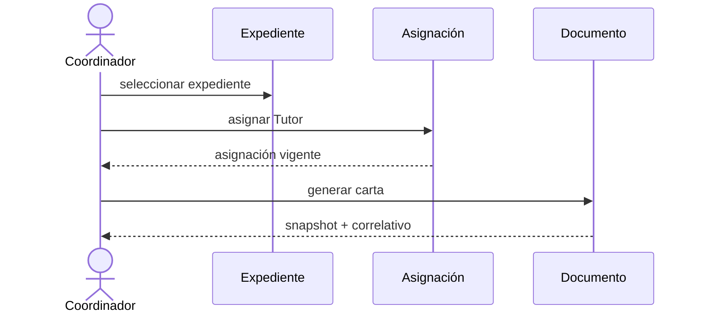
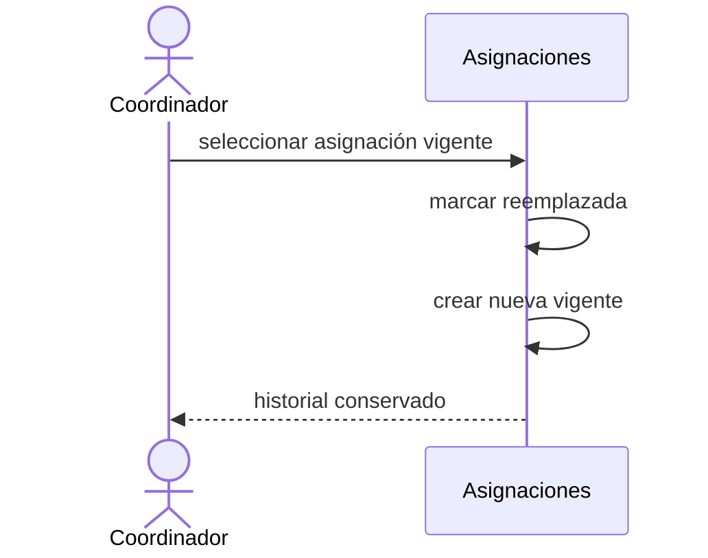
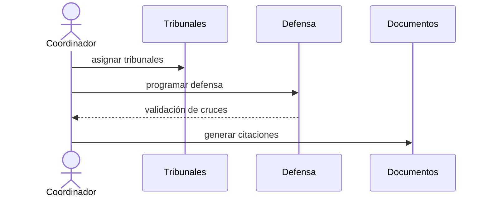

# B4 — Secuencias MG

**Evidencia:** `[PROMPT-MG-SEC-8-B4]`.

## Asignar Tutor + carta

```mermaid
sequenceDiagram
actor C as Coordinador
participant E as Expediente
participant A as Asignación
participant D as Documento
C->>E: seleccionar expediente
C->>A: asignar Tutor
A-->>C: asignación vigente
C->>D: generar carta
D-->>C: snapshot + correlativo
```

## Cambio de Tutor

```mermaid
sequenceDiagram
actor C as Coordinador
participant A as Asignaciones
C->>A: seleccionar asignación vigente
A->>A: marcar reemplazada
A->>A: crear nueva vigente
A-->>C: historial conservado
```

## Defensa + citaciones

```mermaid
sequenceDiagram
actor C as Coordinador
participant T as Tribunales
participant D as Defensa
participant G as Documentos
C->>T: asignar tribunales
C->>D: programar defensa
D-->>C: validación de cruces
C->>G: generar citaciones
```
